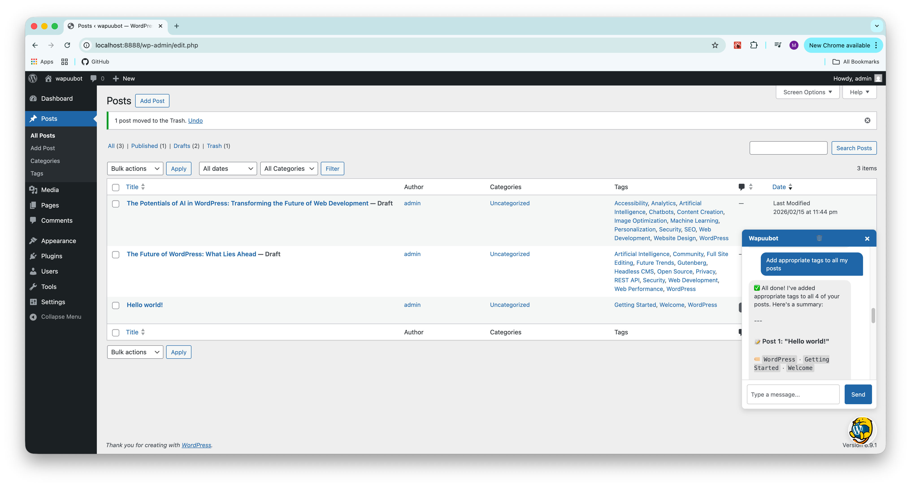
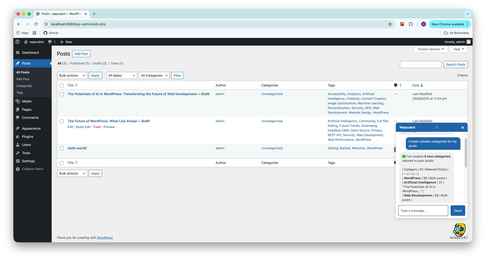
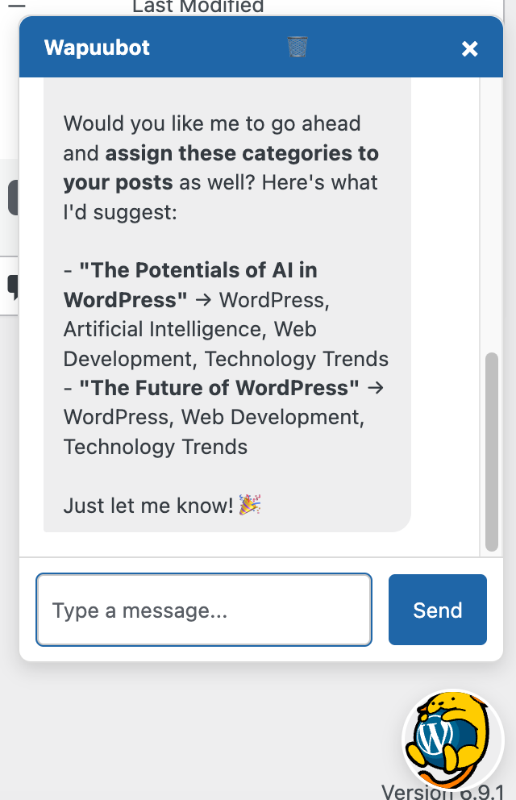
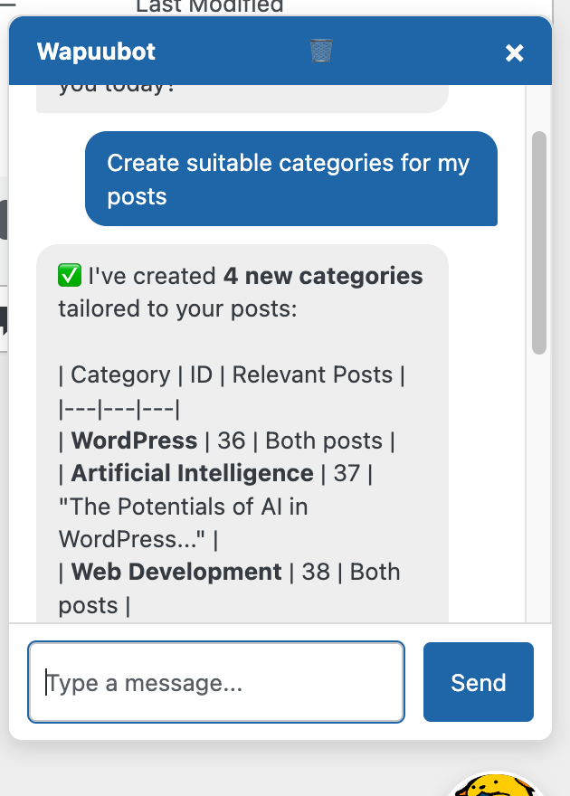

# Wapuubot 🦁

**A smart, AI-powered assistant integrated directly into your WordPress Admin.**

Wapuubot lives in your dashboard as a friendly chat bubble. It uses the **WordPress AI Client** and the **Abilities API** to help you manage your site through natural language conversation. Whether you need to draft a post, organize categories, or tag content, Wapuubot can do it for you.

## ✨ Features

*   **💬 Interactive Chat Interface:** A floating chat bubble in the admin area that opens a persistent chat window.
*   **🧠 Context Aware:** Knows which post you are currently editing and provides relevant suggestions.
*   **📝 Post Management:**
    *   Create new drafts.
    *   Edit existing posts (titles, content, status).
    *   Search for posts by title.
    *   Retrieve post content for analysis.
*   **🏷️ Taxonomy Management:**
    *   Create, list, and delete categories.
    *   Assign categories to posts.
    *   Add tags to posts automatically.
*   **🔌 Extensible:** Built on the **Abilities API**, allowing it to discover and use new tools registered by other plugins.
*   **💾 Persistent History:** Chat history is saved locally, so you can navigate between pages without losing context.

## 📸 Screenshots

| Chat Interface | Post Management |
| :---: | :---: |
|  |  |
| **Wapuubot in Action** | **Context Aware Actions** |

| Tagging & Categories |  |
| :---: | :---: |
|  |  |
| **Intelligent Tagging** | **Advanced Capabilities** |

## 🚀 Installation

### Requirements
*   WordPress 6.4+
*   PHP 7.4+
*   An API Key for an AI Provider (OpenAI, Anthropic, etc.)

### Setup
1.  Clone this repository into your `wp-content/plugins/` directory:
    ```bash
    git clone https://github.com/yourusername/wapuubot.git
    cd wapuubot
    ```
2.  Install dependencies via Composer:
    ```bash
    composer install
    ```
3.  Activate the **Wapuubot** plugin in WordPress.
4.  Navigate to **Settings > AI Credentials** in your WordPress Admin.
5.  Enter your API Key (e.g., OpenAI Key) and save.

## 💡 Usage

1.  Click the **Wapuu Bubble** in the bottom-right corner of your admin screen.
2.  Type a command! Examples:
    *   _"Create a post about the history of jazz."_
    *   _"What tags should I add to this post?"_ (When editing a post)
    *   _"Create a new category called 'Music' and assign this post to it."_
    *   _"Delete the 'Uncategorized' category."_
3.  Wapuubot will execute the actions and confirm when done.

## 🤝 Contributing

We welcome contributions!

1.  **Fork** the repository.
2.  **Create a branch** for your feature (`git checkout -b feature/amazing-feature`).
3.  **Commit** your changes (`git commit -m 'Add amazing feature'`).
4.  **Push** to the branch (`git push origin feature/amazing-feature`).
5.  Open a **Pull Request**.

### Development
*   **Linting:** We use `phpcs` with WordPress Coding Standards. Run `composer run lint` (if configured) or use `phpcs` directly to check your code.
*   **Structure:**
    *   `wapuubot.php`: Main plugin file and chat handler.
    *   `abilities/`: Contains ability registrations and callbacks.
    *   `assets/`: CSS and JS files.

## 📄 License

GPLv2 or later.
